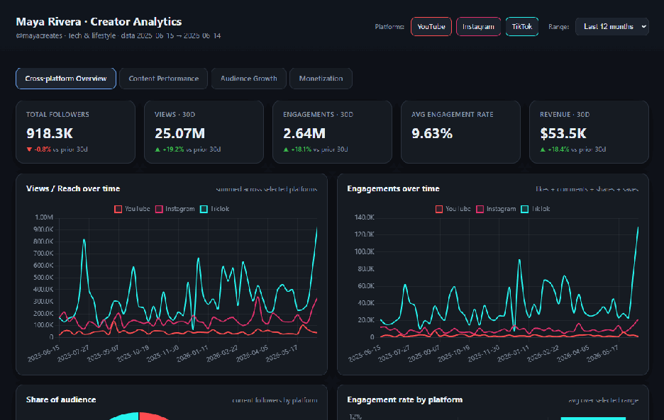
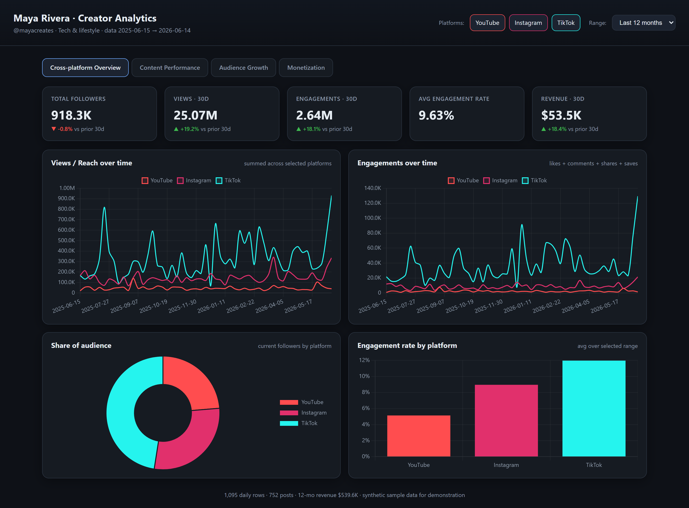
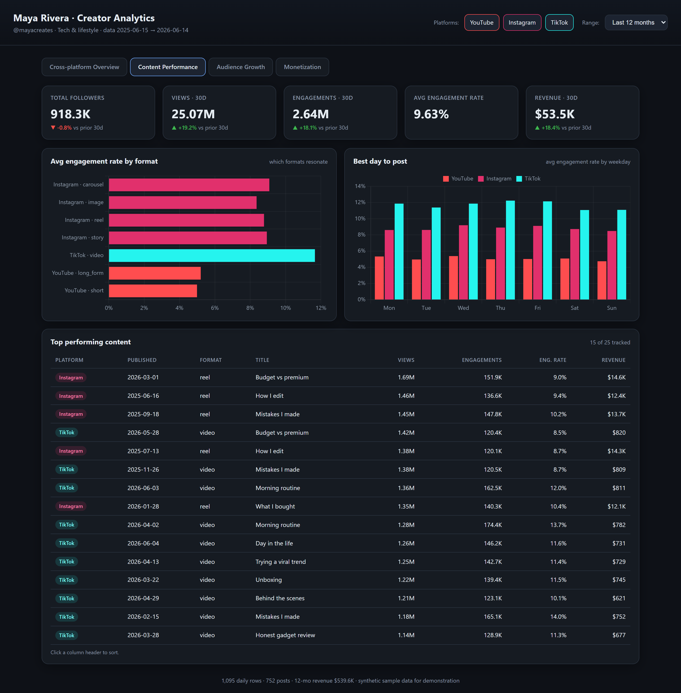
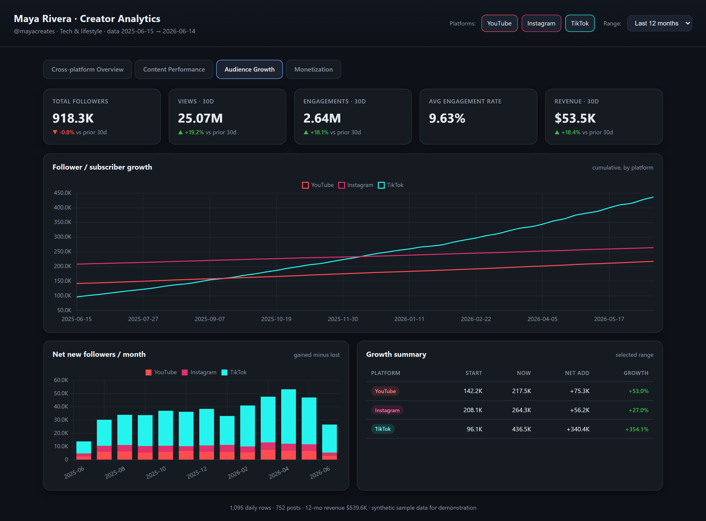
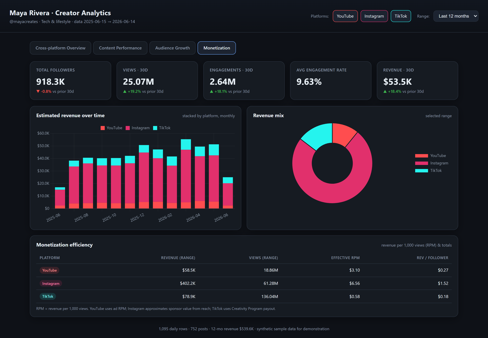

<div align="center">

# 📊 Creator Analytics

### One dashboard for a creator's whole presence — YouTube, Instagram & TikTok in a single view.

An end-to-end data pipeline that pulls a creator's social metrics, models them, and ships an interactive, multi-platform analytics dashboard.

[](https://content-creator-analytics.streamlit.app)
[](https://share.streamlit.io/deploy?repository=addin12%2Fcontent-creator-analytics&branch=main&mainModule=streamlit_app.py)
[](https://www.python.org/)


**[🚀 Live demo](https://content-creator-analytics.streamlit.app)** · _(free-tier app sleeps after inactivity — first load takes ~30s)_

</div>

<div align="center">



<sub>Switching views and toggling platforms — everything recomputes instantly, client-side.</sub>

</div>

---

## Why

Creators live across three platforms that each report numbers differently — different metrics, different denominators, different (or no) revenue data. Pulling it together by hand every week is painful. This project automates the whole loop:

> **acquire → normalize → aggregate → visualize**

…and produces a single dashboard that answers the questions a creator actually cares about: *Where am I growing? What content works? When should I post? Where's the money coming from?*

## ✨ Features

- **🔌 Three platforms, one schema** — YouTube, Instagram & TikTok normalized into a single canonical model.
- **🧪 Runs with zero setup** — a built-in synthetic generator produces a full, realistic year of data using only the Python standard library. `python run.py --demo` → instant dashboard.
- **🔑 Live-ready** — real API connectors (YouTube Data + Analytics, Instagram Graph, TikTok) activate automatically when you add credentials; anything not connected stays synthetic, so it never half-breaks.
- **📈 Four analytical views** — cross-platform overview, content performance, audience growth, and monetization.
- **🎛️ Fully interactive** — toggle platforms, switch the time range (30 / 90 / 180 / 365 days), and sort the content table — everything recomputes client-side.
- **💸 Honest monetization model** — real ad RPM for YouTube; transparent, configurable *estimates* for Instagram (sponsor value from reach) and TikTok (Creativity Program payout).
- **☁️ One-click deploy** to Streamlit Community Cloud (free).

## 🖼️ Screenshots

### Cross-platform Overview
Headline KPIs with 30-day deltas, views & engagement trends, audience split, and engagement rate by platform.


### Content Performance
What formats resonate, the best day of the week to post, and a sortable table of top-performing content.


### Audience Growth
Cumulative follower growth, net new followers per month, and a per-platform growth summary.


### Monetization
Estimated revenue over time, revenue mix, and efficiency (effective RPM & revenue per follower).


## 🚀 Quick start

```bash
# Zero credentials, zero dependencies — synthetic demo:
python run.py --demo --open
```

That generates a full year of data for all three platforms and opens `dist/dashboard.html`.

For the hosted app or live data:

```bash
pip install -r requirements.txt
streamlit run streamlit_app.py          # local Streamlit app
# — or —
python run.py --open                     # auto: live where connected, synthetic elsewhere
```

### CLI

```bash
python run.py --demo                      # force synthetic
python run.py --live                      # force live (errors if creds missing)
python run.py --platforms youtube,tiktok  # subset
python run.py --config config/creators.yaml --open
```

## ☁️ Deploy to Streamlit (free)

1. Go to **[share.streamlit.io](https://share.streamlit.io)** → sign in with GitHub.
2. **Create app → Deploy a public app from GitHub.**
3. Repo `addin12/content-creator-analytics` · Branch `main` · Main file `streamlit_app.py`.
4. **Deploy.** Runs the synthetic demo out of the box.

For live data, add tokens under **Settings → Secrets** (see `.streamlit/secrets.example.toml`) and pick **Live (from secrets)** in the sidebar.

## 🧠 How it works

```
   acquire ─────────► data/raw/*.json
   (per-platform                │
    connector)         normalize ─────► data/processed/{daily,posts}.json
                                 │
                       aggregate ─────► data/processed/dashboard_data.json
                                 │
                          render ─────► dist/dashboard.html  ·  streamlit_app.py
```

| Stage | Module | Responsibility |
|---|---|---|
| **Acquire** | `src/ingest/` | Per-platform connectors. `synthetic.py` (zero-cred) + `youtube.py` / `instagram.py` / `tiktok.py` (live). A mode-aware resolver picks live-or-synthetic per platform. |
| **Normalize** | `src/transform/` | Raw → canonical records; derives engagements, engagement rate, net follower change. |
| **Aggregate** | `src/analytics/` | Canonical → the dashboard `DATA` object: KPIs (30d vs prior-30d), monthly rollups, format & weekday performance, top posts. |
| **Render** | `src/dashboard/` | Injects `DATA` into a self-contained Chart.js template → standalone HTML. |
| **Serve** | `streamlit_app.py` | Reuses the exact pipeline and embeds the dashboard for hosting. |

**Adding a platform** = write one `Connector` subclass that emits the canonical record shapes. Nothing else changes.

## 🔑 Connecting live data

| Platform | Needs | Notes |
|---|---|---|
| **YouTube** | OAuth client + refresh token (or API key) | Analytics & `estimatedRevenue` need the `yt-analytics-monetary.readonly` scope and channel ownership. |
| **Instagram** | Business/Creator account + Graph API long-lived token | No revenue field — sponsor value is **estimated from reach** (`sponsor_rpm`). |
| **TikTok** | TikTok for Developers app + OAuth token | No revenue field — **estimated** from Creativity Program payout (`creativity_rpm`). Day-level series needs Research API; Display API is approximated. |

Put values in `config/creators.yaml`, `.env`, or Streamlit secrets (see the `*.example` files). Missing creds → that platform falls back to synthetic in `auto` mode.

## 🛠️ Tech stack

**Python** (stdlib-only core pipeline) · **Chart.js** (dashboard) · **Streamlit** (hosting) · **Puppeteer + pngjs/gifenc** (`scripts/shoot.mjs` & `scripts/record.mjs` generate the screenshots and demo GIF).

## 📐 Notes on the numbers

- **Engagement rate** uses *reach* as the denominator (reach == views on YouTube/TikTok), matching how each platform reports it.
- **Revenue** is real for YouTube (ad RPM) and *estimated* for Instagram & TikTok — the rates are configurable and labelled as estimates in the dashboard footer.
- Synthetic data is **seeded deterministically** per creator+platform, so demo runs are reproducible.

---

<div align="center">
<sub>Built as a freelance data-analytics showcase. Synthetic data is for demonstration; swap in real API credentials for live reporting.</sub>
</div>
